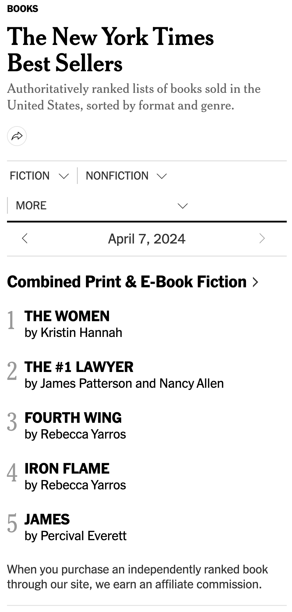

반응형 - 지금은 그냥 넘어가도 될 거 같은데 나중에는 세로 크기도 고려하게 될 때가 올 거 같다.

카테고리 목록 화면 되게 마음에 안 드는데 뭐 신문지 화면을 참조할 수는 없을까.
목록 화면 배경을 신문지 이미지로 아예 해버릴까. 아니면 좀 더 신문지 색깔에 가깝게 할까.
신문지 펼친 것처럼 하자. 이 부분만 배경 이미지를 준다거나 하고. 아예 전체 기본 바탕화면 색을 더 진하게 할 수도 있을 거 같다.
폰트도 문제인 것 같기도 하고.

로딩화면 뭐 책 펼쳐지는 애니메이션이라던가 책 찾는 거라던가. 

한국 책. 카카오 api 등.

검색. 카테고리도, 책도.

책 사진 위에 랭킹

업데이트 날짜 표시. 최신 업데이트 정렬. 이름 순서/ 최신 업데이트 순서 정렬 필터.

약간 3차원처럼 옆으로 움직이는 거 가능한가

홈에서 맨 위에 최근 발행 책들 슬라이드.

어떤 카테고리 들어가도 다른 카테고리 페이지 바로 갈 수 있게. 옆에 링크 목록 살아있게.

http://www.colorhunter.com/tag/newspaper/1

https://framer.university/resources/3d-card-flip-override

