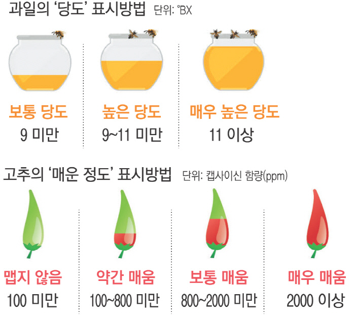

- 테마, 컨셉
  - 당도. 당신 근처의 도서관. 당신이 도서관.
  - 벌꿀. 벌. 당도에 따라 벌집이나 벌꿀통 채워짐.
  - 책 읽는 꿀벌.
  - 너도서관. 너도 도서관. 너도밤나무 도서관.

next 졸작
보니까 뭐 책 관련해서 작품 하나 하고 당근마켓처럼도 하나 하는 것 같다. 이걸 연동해서 책 관련 sns를 하면 좋지 않을까. 두 작품을 연결시키는 거지. 
- 기존 책 정보 연결.
- 책 교환, 중고판매, 대여.
  - 내가 읽고 싶은 책 대여받는 것. 대여비 내고.
  - "~~책 구합니다" 라고 글 올리면 있는 사람이 빌려줌.
  - "~~책 있습니다, 대여합니다" 글 보고 필요한 사람이 가서 빌림. 
  - 책 정보 클릭하면 주변에 판매, 대여하는 사람 있으면 정보 뜸.
  - 
- 책 커버나 언급을 해야 포스팅 가능. 
- 책 관련 얘기. 댓글이나 채팅으로 가능. 
  - !!!!책 마다 채팅방이 있다. 그래서 그냥 수다 떤다. 가볍게. 그냥 책 관련해서 하고 싶은 말들 한마디씩 하고 토론하고 하는 거지. 나갈 땐 맘대로 나가고. 
- 독서습관 늘리기.
- 도서관과 연동?
- 안 그래도 책 관련 서비스 만들어보고 싶었는데 이걸 기회로 생각해보자. 
- 뽀모도로 응용해서 책 집중 타임.

- 참고자료
  - 어바웃 페이지 아모레 퍼시픽
    - https://www.apgroup.com/int/ko/about-us/about-us.html
    - https://www.searchenginejournal.com/about-us-page-examples/250967/  